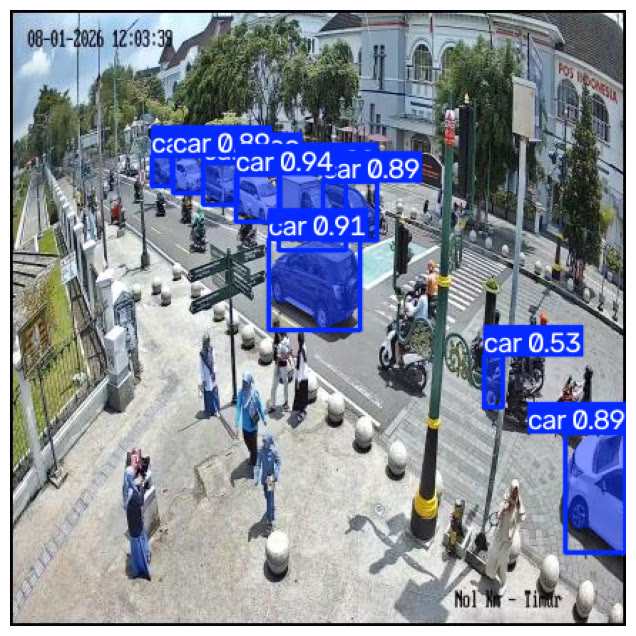
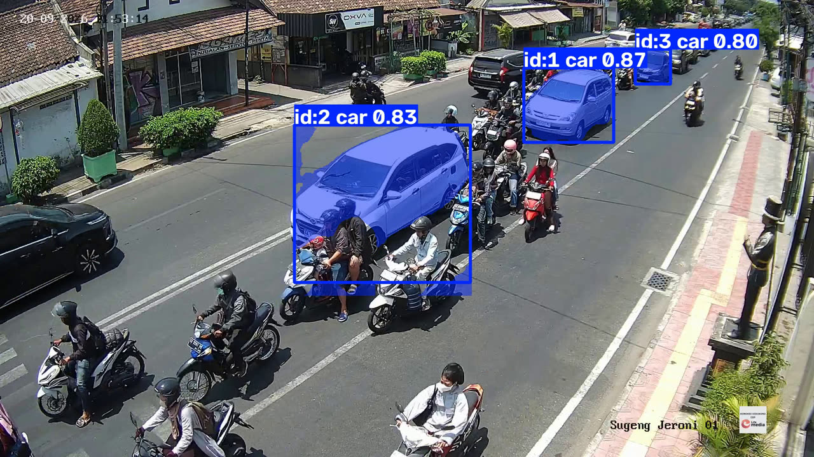

# Segmentasi Instance Mobil dengan YOLOv8-seg

Model YOLOv8s-seg hasil fine-tuning untuk segmentasi instance mobil, dilatih pada dataset kecil bersumber CCTV dan diuji langsung ke feed CCTV lalu lintas publik di Yogyakarta.



## Ringkasan

- **Tugas**: instance segmentation (bukan sekadar bounding box) untuk mobil
- **Model dasar**: `yolov8s-seg.pt` (Ultralytics, pretrained COCO)
- **Data training**: dataset `car-detection` di Roboflow (201 gambar train / 19 validasi, 1 kelas: `car`)
- **Uji langsung**: feed CCTV ATCS publik (Sugeng Jeroni, Yogyakarta) via stream HLS
- **Fitur tambahan**: hitung mobil real-time dengan dua filter pasca-proses (ukuran kotak minimum, rasio-isi mask) untuk mengurangi kotak yang salah kebaca

## Hasil (terverifikasi di validation set)

Dilatih 30 epoch di `imgsz=640`, batch size 32.

| Metrik | Box | Mask |
|---|---|---|
| Precision | 0.860 | 0.895 |
| Recall | 0.867 | 0.797 |
| mAP50 | 0.885 | 0.878 |
| mAP50-95 | 0.668 | 0.604 |

Contoh inference di gambar test set di atas: 6 dari 7 mobil yang terlihat terdeteksi benar dengan confidence tinggi (0.86-0.94); satu mobil kecil yang sebagian terhalang di dekat motor-motor sebelah kanan cuma tertangkap lemah (0.53), konsisten dengan gap recall yang dibahas di bagian **Keterbatasan**.



## Hitung mobil dari CCTV langsung

Notebook ini terhubung langsung ke stream HLS CCTV publik, menjalankan inference per-frame, dan menghitung mobil secara real-time. Contoh hasil run 600-frame di `conf=0.62`:

- Rata-rata mobil per frame: ~2.1
- Maksimal mobil dalam satu frame: 4
- Kecepatan proses: ~20-70 FPS tergantung kompleksitas adegan (GPU Colab T4/A100)

Output-nya berupa file `.mp4` dengan mask overlay dan file `.json` berisi statistik per-run.

<!-- VIDEO-DEMO-PLACEHOLDER: tempel embed video hosting GitHub di sini -->

## Filter pasca-proses

Karena model ini cuma 1 kelas (`car`), model tidak pernah diajari contoh negatif untuk jenis kendaraan lain. Dua filter ringan diterapkan di atas output model mentah untuk mengurangi kotak yang salah kebaca (misalnya pengendara motor dengan muatan besar atau jaket tebal yang kadang menyerupai siluet mobil):

1. **Ukuran kotak minimum** — membuang deteksi dengan kotak yang terlalu kecil untuk ukuran mobil di jarak kamera ini.
2. **Rasio-isi mask** — mask segmentasi mobil asli mengisi hampir seluruh kotaknya; mask motor+pengendara jauh lebih "berlubang". Deteksi dengan rasio isi di bawah ambang tertentu dibuang.

Filter ini mengurangi, tapi tidak menghilangkan total, angka salah-kebaca. Lihat bagian **Keterbatasan** di bawah.

## Keterbatasan

Ini didokumentasikan jujur, bukan disembunyikan:

- **Model 1 kelas**: model ini tidak pernah dilatih dengan kelas negatif "bukan mobil". Dua percobaan retrain dengan kelas `motorcycle` eksplisit sudah dicoba dan sama-sama tidak berhasil:
  - Dataset publik besar dan beragam (Vehicle Classification V2, ~3.7k gambar) menghasilkan metrik validasi bagus (car mAP50 0.90, motorcycle mAP50 0.85) tapi **nol deteksi nyata** di CCTV asli — contoh nyata masalah domain-shift dalam computer vision.
  - Dataset gabungan (data CCTV project ini + dataset kecil bersumber CCTV dengan kelas motorcycle) cuma punya 22 instance motorcycle total — terlalu sedikit untuk belajar kelas yang berguna.
- **Sisa salah-kebaca masih ada**: saat tuning confidence threshold, muncul trade-off precision/recall yang jelas — menaikkan threshold untuk menyaring motor yang salah kebaca juga bikin beberapa mobil asli (terutama warna gelap dengan silau kuat) jadi sama sekali tidak terdeteksi. Nilai final `conf=0.62` adalah titik tengah yang disengaja, bukan solusi sempurna.
- **Dataset training kecil** (201 gambar): variasi jenis bodi, sudut, dan pencahayaan kendaraan yang terbatas kemungkinan menjelaskan sebagian gap recall yang terlihat di footage nyata.
- **Timing video**: file `.mp4` hasil rekaman di-encode pada frame rate tetap, terlepas dari kecepatan capture real-time CCTV yang sebenarnya, jadi durasi playback tidak berbanding 1:1 dengan waktu capture asli.

## Struktur repository

```
├── car_instance_segmentation.ipynb   # pipeline lengkap: dataset, training, inference, live CCTV
├── images/                           # contoh hasil segmentasi
├── README.md                         # versi bahasa Inggris
├── README.id.md
└── LICENSE
```

## Setup

1. Buka notebook di Google Colab (disarankan runtime GPU).
2. Tambahkan secret `ROBOFLOW_API_KEY` di Colab (Settings → Secrets), atau masukkan manual saat diminta.
3. Jalankan cell secara berurutan. Kalau model hasil training sebelumnya sudah ada di Google Drive kamu di `car_instance_segmentation/best.pt`, notebook akan langsung memuatnya tanpa training ulang.
4. Cell live CCTV secara default mengarah ke kamera lalu lintas publik Yogyakarta — ganti dengan URL stream HLS (`.m3u8`) lain untuk uji di lokasi berbeda.

File bobot model (`*.pt`) tidak disertakan di repository ini — lihat `.gitignore`.

## Lisensi

MIT — lihat [LICENSE](LICENSE).
